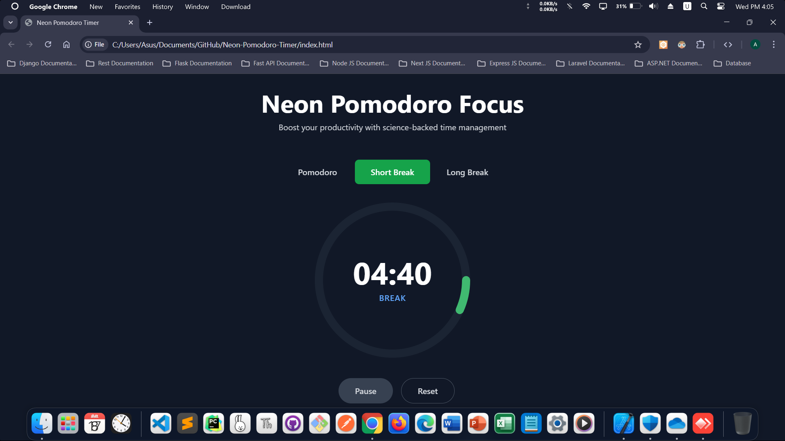

  <a href="https://amirhosseingholami-dev.github.io/Neon-Pomodoro-Timer/" 
     target="_blank" 
     style="text-decoration: none; color: #00bfff; font-size: 2.2em; font-weight: 800; text-shadow: 0 0 10px #00bfff, 0 0 20px #00bfff;">
    Neon Pomodoro Timer
  </a>

  

  A sleek, responsive Pomodoro timer with neon glow effects and glassmorphism UI.  
  Built with Tailwind CSS, Chart.js, and vanilla JavaScript.  
  Features animated progress ring, session tracking, customizable durations, and motivational quotes.  
  No frameworks — just pure productivity.

  <a href="https://amirhosseingholami-dev.github.io/Neon-Pomodoro-Timer/" target="_blank">🎯 Live demo</a> ·
  <a href="https://github.com/AmirHosseinGholami-DEV/Neon-Pomodoro-Timer/" target="_blank">💻 Source</a>

